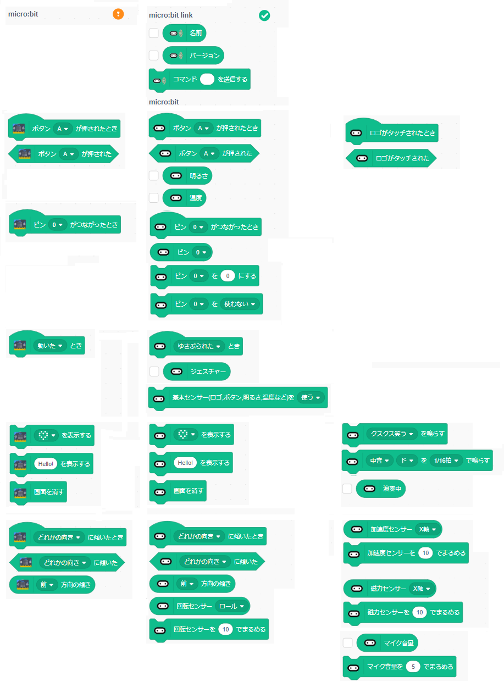

# sc3-mbituart

- このリポジトリ

	- scratch-linkを改造(BLE UART対応)
	- bluetooth extensionのBLE部を分離・改造

## ブロック

- 左が標準で組み込まれているmicro:bit拡張機能のブロックです。
- 右はこの拡張機能で使えるブロックです。
- ジェスチャーは、micro:bit V2仕様です。
- 効果音は、micro:bit V2仕様です。

注意）センサーはなにもしないと動作しません。

- ロゴ、ボタン、明るさ、温度、ジャスチャーは、基本センサーを「使う」ブロックを１回度動作させてください。
- ピンは、デジタル、アナログを選択するブロックを１回度動作させてください。
- 加速度、磁力、回転センサーは、まるめ値として1以上の値を指定してブロック１回動作させてください。 
まるめ値として0を指定して動作させた後は、センサーの値は変化しません。 

